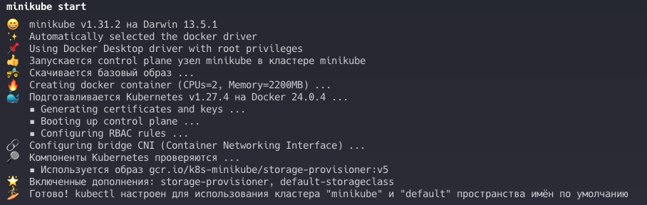
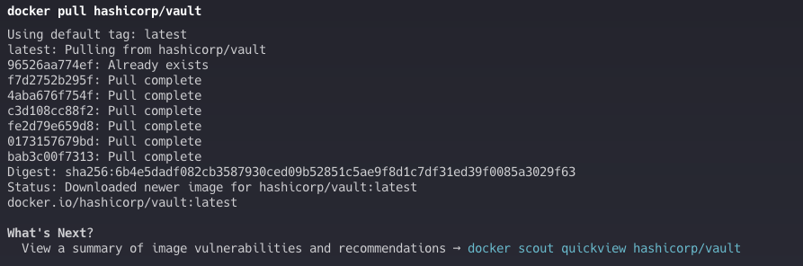
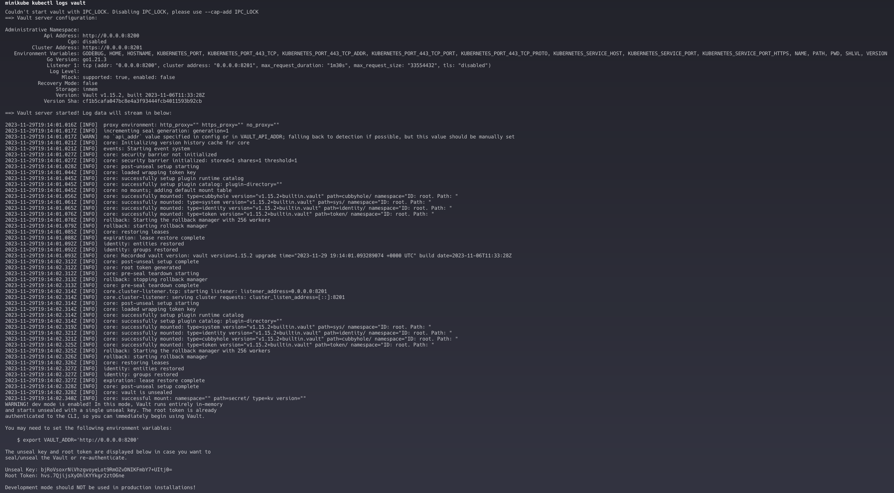
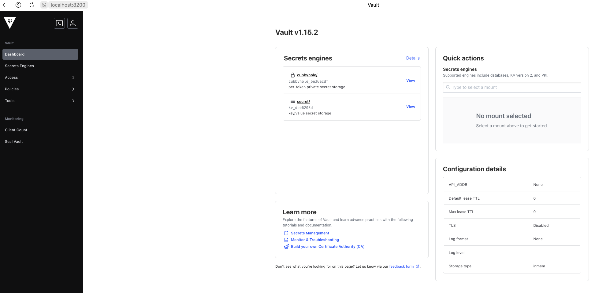
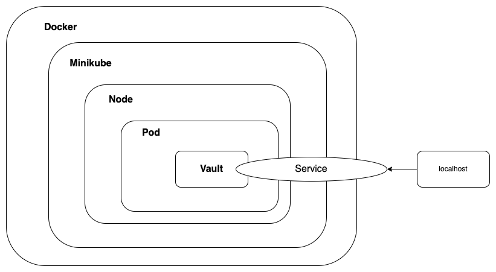

University: [ITMO University](https://itmo.ru/ru/)  
Faculty: [FICT](https://fict.itmo.ru)  
Course: [Introduction to distributed technologies](https://github.com/itmo-ict-faculty/introduction-to-distributed-technologies)  
Year: 2023/2024  
Group: K4111c  
Author: Tarzyan Vera Pavlovna  
Lab: Lab1  
Date of create: 29.11.2023  
Date of finished: 30.11.2023  

# Лабораторная работа №1 "Установка Docker и Minikube, первый манифест."

### Описание
Это первая лабораторная работа в которой вы сможете протестировать Docker, установить Minikube и развернуть свой первый "под".

### Цель работы
Ознакомиться с инструментами Minikube и Docker, развернуть свой первый "под".

### Ход работы
1. Был установлен Docker, установлен и запущен Minikube  

2. Был скачан образ контейнера  

3. Был запущен контейнер  

4. Был создан и запущен "под"  

5. Был создан сервис для доступа к контейнеру  

6. Данная команда помогла попасть в контейнер  

7. Для входа в vault использовался токен, найденный в логах  

8. Был введён токен и произведен вход в vault  

9. Был создан файл с расширением yaml для развертывания "пода"  

### Вывод
В результате выполнения работы были изучены Docker и Minikube, был развернут "под" и создан файл с расширением yaml для его развертывания. Также была создана схема организации контейнеров и сервисов нарисованная в draw.io.  
