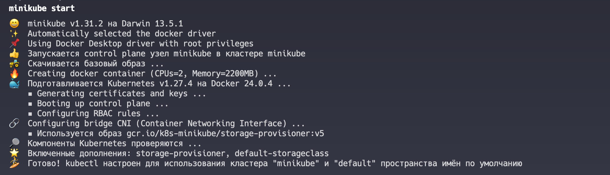
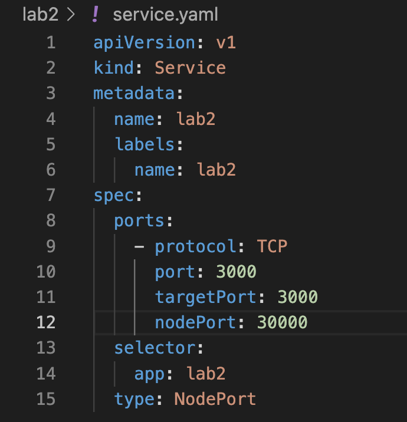
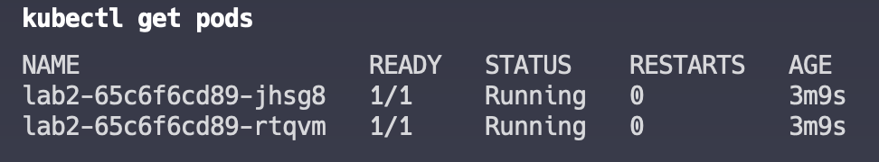
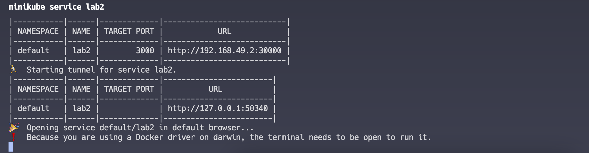
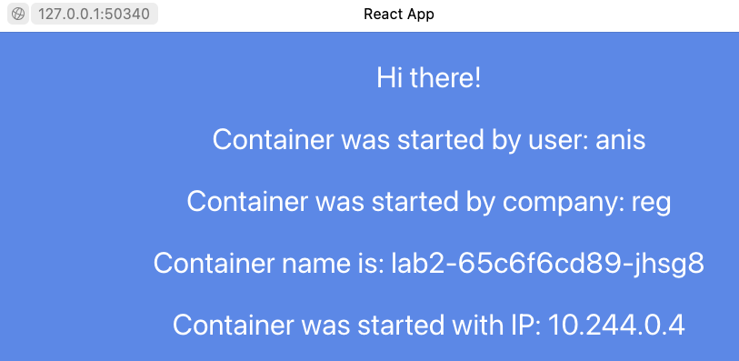
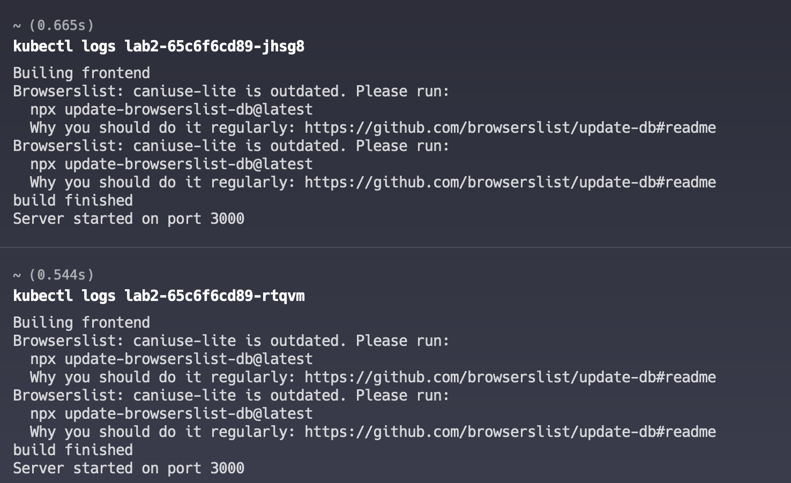

University: [ITMO University](https://itmo.ru/ru/)  
Faculty: [FICT](https://fict.itmo.ru)  
Course: [Introduction to distributed technologies](https://github.com/itmo-ict-faculty/introduction-to-distributed-technologies)  
Year: 2023/2024  
Group: K4111c  
Author: Tarzyan Vera Pavlovna  
Lab: Lab2  
Date of create: 30.11.2023  
Date of finished: 30.11.2023  

# Лабораторная работа №2 "Развертывание веб сервиса в Minikube, доступ к веб интерфейсу сервиса. Мониторинг сервиса."

### Описание
В данной лабораторной работе вы познакомитесь с развертыванием полноценного веб сервиса с несколькими репликами.

### Цель работы
Ознакомиться с типами "контроллеров" развертывания контейнеров, ознакомится с сетевыми сервисами и развернуть свое веб приложение.

### Ход работы
1. Был запущен Minikube  

2. Был создан Deployment с двумя репликами контейнера из указанного образа  

3. Был создан Service для доступа к подам  

4. Был запущен Deployment и Service  

5. Был проверен статус подов  

6. Были проброшены порты через minikube  

7. Была проверена страница на веб-браузере  

8. Были проверены логи контейнеров  

### Вывод
В результате выполнения работы ознакомились с типами "контроллеров" развертывания контейнеров, был создан сервис, через который был предоставлен доступ на эти "поды". Была проверена страница на веб-браузере. Были проверены логи контейнеров. Также была создана схема организации контейеров и сервисов нарисованная в draw.io.  

