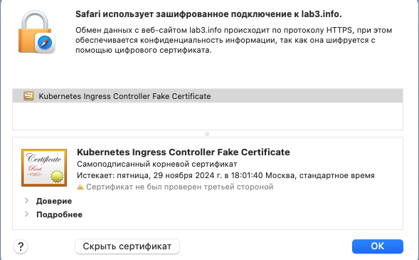

University: [ITMO University](https://itmo.ru/ru/)  
Faculty: [FICT](https://fict.itmo.ru)  
Course: [Introduction to distributed technologies](https://github.com/itmo-ict-faculty/introduction-to-distributed-technologies)  
Year: 2023/2024  
Group: K4111c  
Author: Tarzyan Vera Pavlovna  
Lab: Lab3  
Date of create: 30.11.2023  
Date of finished: 30.11.2023  

# ЛЛабораторная работа №3 "Сертификаты и "секреты" в Minikube, безопасное хранение данных."

### Описание
В данной лабораторной работе вы познакомитесь с сертификатами и "секретами" в Minikube, правилами безопасного хранения данных в Minikube.

### Цель работы
Познакомиться с сертификатами и "секретами" в Minikube, правилами безопасного хранения данных в Minikube.

### Ход работы
1. Был запущен Minikube  

2. Был создан ConfigMap со значениями переменных  

3. Был создан ReplicaSet, в который былы переданы указанные переменные  

4. Был создан tls секрет, в который были прописаны созданные приватный и публичный ключи  

5. Был создан Service для приложения  

6. Был создан Ingress, в который были переданы ключи из секрета, а также был указан путь, по которому будет доступно приложение  

7. Был произведён деплой  

8. Был включён Ingress в Minikube  

9. Был проложен сетевой туннель между локальным компьютером и кластером Kubernates  

10. Для пользователей MacOS/Windows необходимо указывать в hosts localhost, что и было сделано. Хотя в документации сказано, что в hosts надо указывать ip minikube. Как позже выяснилось, эта информация актуальна только для Linux  

11. Была проверена страница на веб-браузере  

12. Сертификат  

### Вывод
В результате выполнения работы ознакомились с сертификатами и  "секретами" в Minikube, правилами безопасного хранения данных в Minikube. Была проверена страница на веб-браузере. Также была создана схема организации контейеров и сервисов нарисованная в draw.io.  
