University: [ITMO University](https://itmo.ru/ru/)  
Faculty: [FICT](https://fict.itmo.ru)  
Course: [Introduction to distributed technologies](https://github.com/itmo-ict-faculty/introduction-to-distributed-technologies)  
Year: 2023/2024  
Group: K4111c  
Author: Tarzyan Vera Pavlovna  
Lab: Lab4  
Date of create: 6.12.2023  
Date of finished: 7.12.2023  

# Лабораторная работа №4 "Сети связи в Minikube, CNI и CoreDNS"

### Описание
Это последняя лабораторная работа в которой вы познакомитесь с сетями связи в Minikube. Особенность Kubernetes заключается в том, что у него одновременно работают underlay и overlay сети, а управление может быть организованно различными CNI.

### Цель работы
Познакомиться с CNI Calico и функцией IPAM Plugin, изучить особенности работы CNI и CoreDNS.

### Ход работы
1. Был запущен Minikube с подключенным плагином calico и двумя нодами  
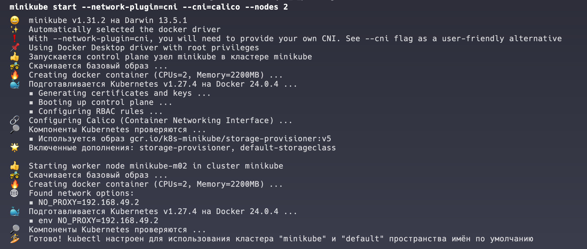
2. Было проверено наличие подов calico  
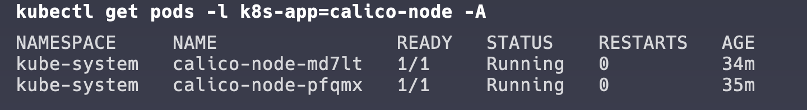
3. Было проверено наличие двух разных нод  
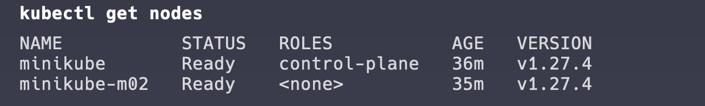
4. Были созданы лэйблы нодам  
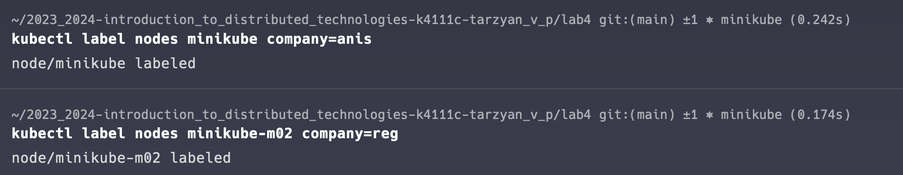
5. Был установлен calicoctl для Mac OSX  
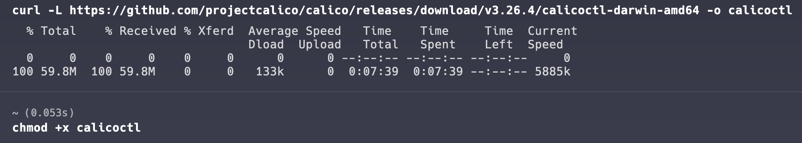
6. Был удален дефолтный ippool  
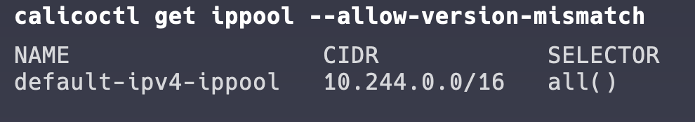
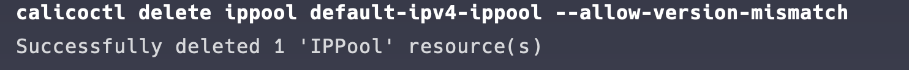
7. Были созданы собственные ippool 
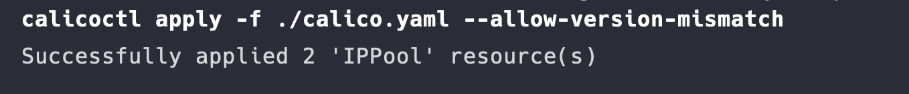
8. Было проверено, что наши ippool созданы, был произведён деплой  
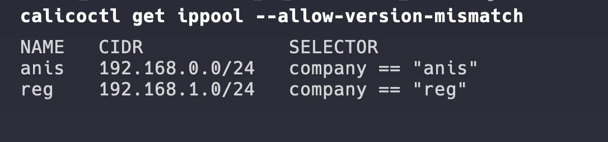
9. Было развернуто приложение с сервисом  
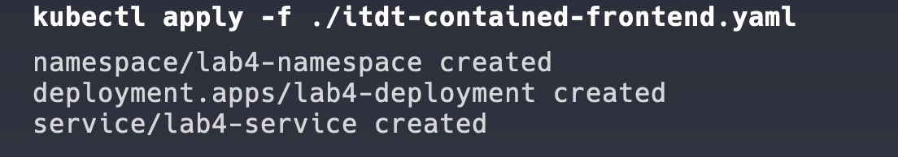
10. Были проверены ip адреса  
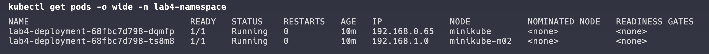
11. Было подключение к одному из подов и пинганули соседний. Пинг прошел, значит связь между ними есть  
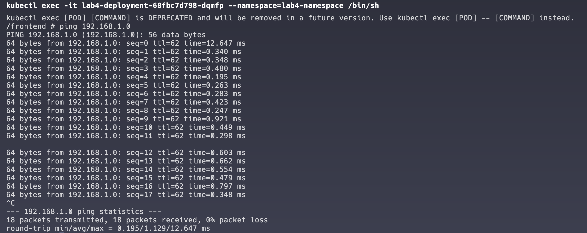
12. Были проброшены порты сервиса  
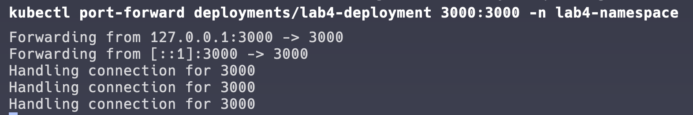
13. Была проверена страница на веб-браузере  
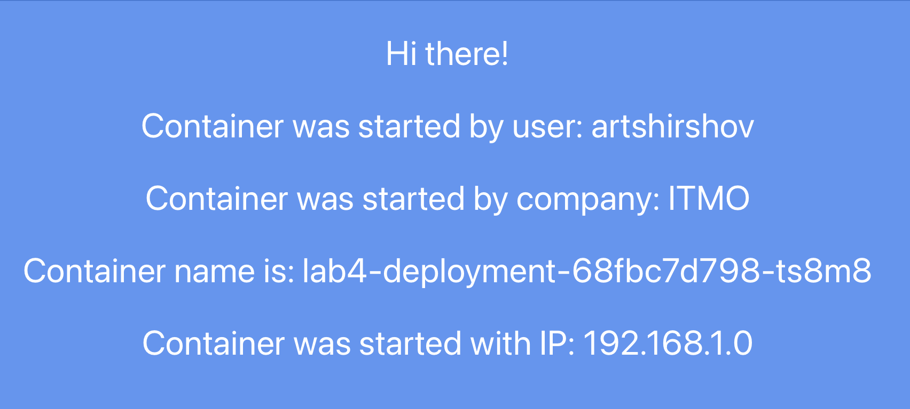

### Вывод
В результате выполнения лабораторной работы, ознакомились с CNI Calico и функцией IPAM Plugin, а также изучили особенности работы CNI и CoreDNS. Была проверена страница на веб-браузере. Также была создана схема организации контейеров и сервисов нарисованная в draw.io.  
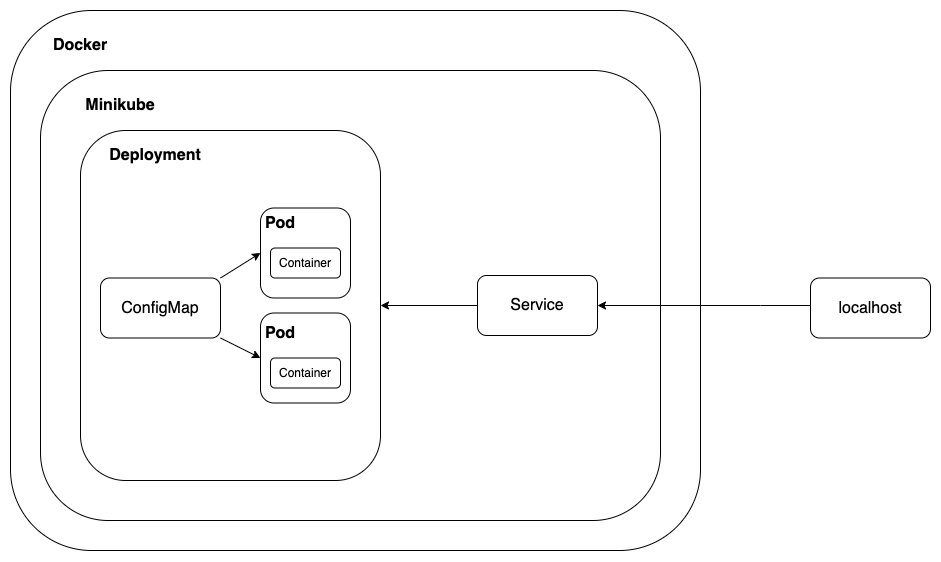